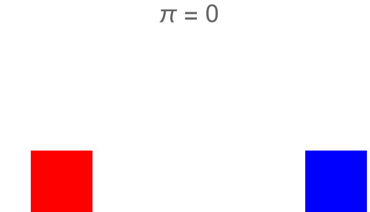

# Pi Approximation via Collisions

## Overview

This project explores the approximation of π by simulating collisions between two blocks and a wall. The inspiration for this project comes from G. Galperin's work titled ["Playing Pool with π"](https://www.maths.tcd.ie/~lebed/Galperin.%20Playing%20pool%20with%20pi.pdf) and the 3blue1brown video ["Why do colliding blocks compute π?"](https://www.youtube.com/watch?v=HEfHFsfGXjs). The simulation utilizes  formulas for [elastic collision](https://en.wikipedia.org/wiki/Elastic_collision) and [Euler's Integration method](https://en.wikipedia.org/wiki/Euler_method) to expedite calculations with larger timesteps.

## Illustration

## Sources

- [G. Galperin's "Playing Pool with π"](https://www.maths.tcd.ie/~lebed/Galperin.%20Playing%20pool%20with%20pi.pdf)
- [3blue1brown Video: "Why do colliding blocks compute π?"](https://www.youtube.com/watch?v=HEfHFsfGXjs)
- [Elastic collision](https://en.wikipedia.org/wiki/Elastic_collision)
- [Euler's Integration method](https://en.wikipedia.org/wiki/Euler_method)

## Instructions

1. **Requirements**: Ensure you have Wolfram Mathematica installed.
2. **Execution**: Open the provided Mathematica notebook.
3. **Run the Simulation**: Execute the notebook to simulate the collisions and observe the π approximation.

## Simulation Parameters

- **`mn`**: Number of digits in the approximation.
- **`m1`**: Mass of block 1.
- **`m2`**: Mass of block 2.
- **`timesteps`**: Number of simulation steps.
- **`v1`**: Initial velocity of block 1.
- **`v2`**: Initial velocity of block 2.
- **`d`**: Width of the blocks.
- **`x1`**: Initial position of block 1.
- **`x2`**: Initial position of block 2.

## Acknowledgments

- G. Galperin for the Playing Pool with π theory.
- 3blue1brown for the insightful video on colliding blocks and π.

## License

This project is licensed under the [MIT License](LICENSE.md).
